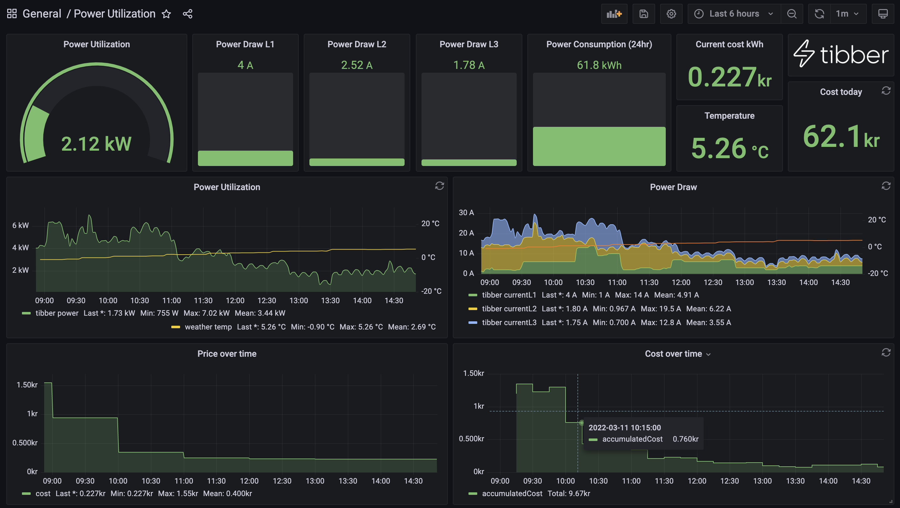

# Tibber realtime monitoring

1. Run `docker-compose up -d` to start grafana and influx.
2. Log into influx and define a org, bucket and create a read/write token.
3. Update config.ini
4. Run realTime as a daemon ./realTime.py
5. Run currentPrice via cron
`* * * * * /root/tibber/currentPrice.py`

Import dashboard to grafana and point it to Influx.

